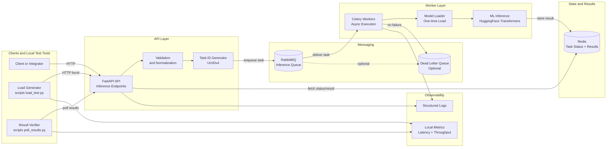

# Distributed Async ML Engine

## Overview

Distributed Async ML Engine is a backend-only system designed to run **computationally expensive machine learning inference asynchronously** without blocking API requests or overwhelming system resources.

Instead of executing heavy ML models synchronously inside a REST API, this system decouples request handling from model execution using **task queues and distributed workers**. This keeps the API responsive under load while allowing inference capacity to scale independently.

The project focuses on **system design, reliability, and performance**, not frontend UX or model research.

---

## Problem Statement

Modern ML models such as Transformers (BERT, ResNet, etc.) are CPU- and memory-intensive.  
When these models are executed directly inside a traditional REST API:

- API requests block for seconds
- CPU cores get saturated quickly
- Requests time out under moderate concurrency
- The entire service becomes unstable with only tens or hundreds of concurrent users

This is a common real-world failure mode when teams attempt to deploy ML models behind synchronous APIs.

---

## Why This Problem Matters

This issue appears in many real systems:

- SaaS products offering ML-powered features (sentiment analysis, moderation, ranking)
- Internal tools processing large batches of text or images
- ML teams deploying inference without dedicated infrastructure
- Startups running ML workloads on limited CPU resources

The challenge is **serving ML inference reliably without blocking user-facing services**.

---

## Solution Overview

This project implements an **asynchronous, distributed inference architecture**:

- A thin API layer accepts requests and returns a `task_id` immediately
- Heavy ML inference is executed by background worker processes
- A message broker buffers work and provides backpressure
- Results are stored and retrieved asynchronously

This design ensures:
- Low API latency under load
- Controlled CPU usage
- Fault isolation between API and inference
- Retry and failure handling

---

## Who This Project Is For

This project is relevant for:

- Backend engineers integrating ML into APIs
- ML engineers deploying inference services
- Platform / infrastructure engineers
- Engineers learning production-grade ML system design

It is especially useful for understanding **how ML inference is deployed in real systems**, beyond notebooks and demos.

---

## Why I Built This Project

I built this project to demonstrate:

- Production-style asynchronous system design
- Safe integration of heavy ML workloads into backend services
- Task queue–based decoupling and worker pools
- Load testing and verification without real users
- Applying ML models in a systems context

The emphasis is on **architecture, scalability, and reliability** rather than model accuracy.

---

## Architecture

The system follows a classic async processing pattern:

- API handles request intake only
- Message broker queues inference tasks
- Worker pool performs ML inference
- Result backend stores inference output

## System Architecture

The diagram below shows the major components of the system and how they interact.

## Technology Stack & Rationale

### Python
Strong ecosystem for backend systems and machine learning, with excellent async and ML library support.

### FastAPI
Used as a thin, high-performance API layer to accept inference requests and return task IDs quickly without blocking.

### RabbitMQ (Message Broker)
Provides reliable task queue semantics, backpressure handling, and is well-suited for task-based workloads.

### Celery (Workers)
Manages distributed task execution with built-in retries, concurrency control, and failure handling.

### Redis (Result Backend)
Low-latency key-value store used to track task status and store inference results for retrieval.

### HuggingFace Transformers (ML)
Pre-trained Transformer models simulate realistic, CPU-heavy inference workloads commonly used in production.

---

## System Workflow

1. A client submits an inference request with text input
2. The API enqueues the task and returns a `task_id` immediately
3. A Celery worker picks up the task from RabbitMQ
4. The worker runs ML inference using a Transformer model
5. The result is stored in Redis, keyed by `task_id`
6. The client polls for the result using the `task_id`

---

## Running the Project Locally

### Prerequisites
- Docker
- Docker Compose
- Python 3.10+